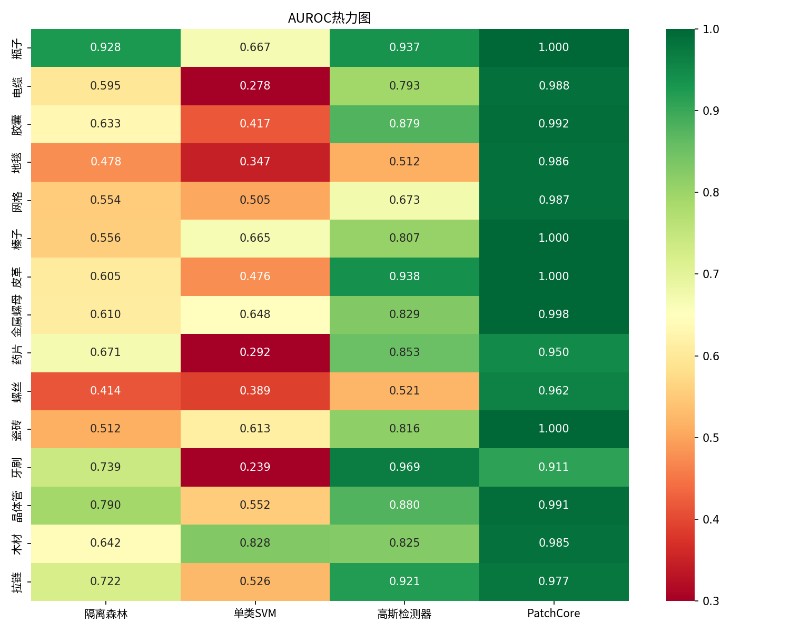
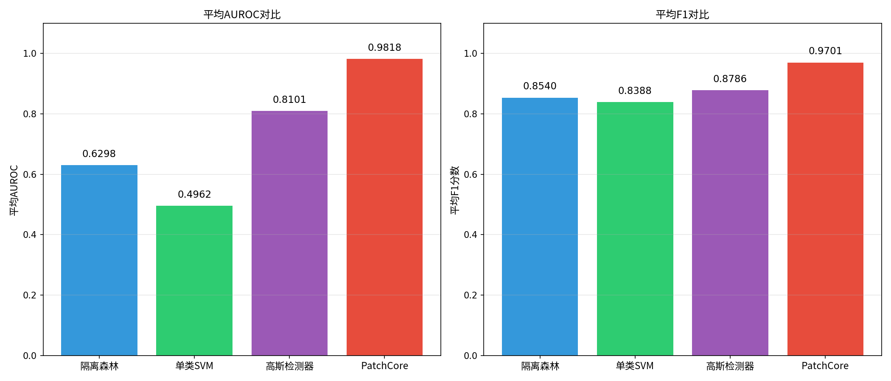
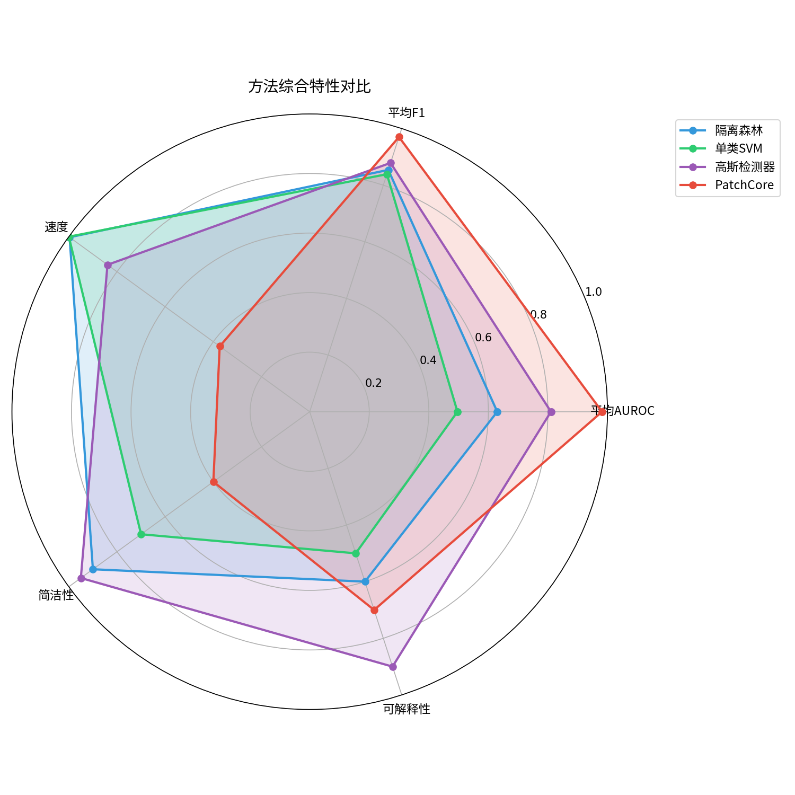
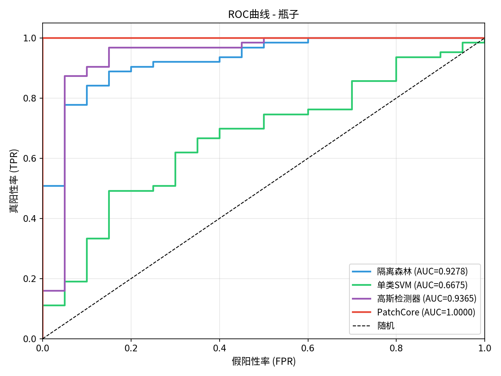
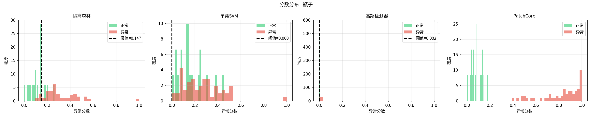

# 基于无监督学习的工业产品表面缺陷检测

本项目针对工业产品表面缺陷检测问题，采用无监督学习方法，在 MVTec AD 数据集的全部 15 个类别上进行系统性研究。实验同时实现了传统机器学习方法（隔离森林、单类SVM、高斯异常检测器）和深度学习方法（PatchCore），通过提取 HOG、LBP 和颜色直方图等手工特征与基于预训练神经网络的深度特征进行对比分析。

## 实验结果

深度学习方法 PatchCore 在 15 个类别上取得了平均 **0.9818** 的 AUROC，其中 bottle、hazelnut、leather、tile 四个类别达到了 100% 的检测精度；传统方法中高斯检测器表现最佳，平均 AUROC 达到 **0.8101**。

| 类别 | 隔离森林 | 单类SVM | 高斯检测器 | PatchCore |
|------|---------|---------|-----------|-----------|
| bottle | 0.9278 | 0.6675 | 0.9365 | **1.0000** |
| cable | 0.5954 | 0.2783 | 0.7931 | **0.9876** |
| capsule | 0.6326 | 0.4172 | 0.8787 | **0.9916** |
| carpet | 0.4775 | 0.3471 | 0.5124 | **0.9864** |
| grid | 0.5539 | 0.5046 | 0.6725 | **0.9875** |
| hazelnut | 0.5557 | 0.6646 | 0.8071 | **1.0000** |
| leather | 0.6046 | 0.4762 | 0.9375 | **1.0000** |
| metal_nut | 0.6105 | 0.6476 | 0.8289 | **0.9980** |
| pill | 0.6708 | 0.2916 | 0.8527 | **0.9504** |
| screw | 0.4138 | 0.3892 | 0.5208 | **0.9617** |
| tile | 0.5119 | 0.6133 | 0.8160 | **1.0000** |
| toothbrush | 0.7389 | 0.2389 | **0.9694** | 0.9111 |
| transistor | 0.7904 | 0.5525 | 0.8796 | **0.9913** |
| wood | 0.6421 | 0.8281 | 0.8254 | **0.9851** |
| zipper | 0.7216 | 0.5263 | 0.9210 | **0.9766** |
| **平均** | 0.6298 | 0.4962 | 0.8101 | **0.9818** |

### 可视化结果

#### AUROC 热力图


#### 平均性能对比


#### 方法综合特性对比


#### ROC 曲线 (以 Bottle 类别为例)


#### 异常分数分布 (以 Bottle 类别为例)


#### PatchCore 异常定位热力图 (以 Leather 类别为例)


## 项目结构

```
PatternRecognition/
├── main.py                 # 主程序入口
├── src/
│   ├── data/
│   │   └── dataset.py      # 数据集加载
│   ├── traditional/
│   │   ├── features.py     # 特征提取 (HOG, LBP, 颜色直方图)
│   │   └── detector.py     # 传统检测器 (隔离森林, 单类SVM, 高斯)
│   ├── deep_learning/
│   │   └── patchcore.py    # PatchCore 深度学习方法
│   └── evaluation/
│       └── metrics.py      # 评估指标 (AUROC, AUPR, F1)
├── data/                   # 数据集目录
├── results/                # 实验结果
│   └── comprehensive/      # 完整评测结果
│       ├── figures/        # 图表
│       ├── visualizations/ # 可视化
│       └── data/           # JSON结果
└── doc/                    # 文档图片
```

## 环境配置

### 依赖安装

```bash
pip install numpy scipy scikit-learn scikit-image opencv-python matplotlib seaborn tqdm pillow torch torchvision anomalib
```

或使用 uv:

```bash
uv sync
```

### 数据集准备

1. 从 [MVTec AD 官网](https://www.mvtec.com/company/research/datasets/mvtec-ad) 下载数据集
2. 解压后放置到 `data/` 目录，确保目录结构如下:

```
data/
├── bottle/
│   ├── train/
│   │   └── good/
│   └── test/
│       ├── good/
│       ├── broken_large/
│       └── ...
├── cable/
├── capsule/
└── ... (共15个类别)
```

## 使用方法

### 运行完整评测

```bash
python main.py
```

### 评测单个类别

```bash
python main.py --category bottle
```

### 仅运行传统方法 (跳过深度学习)

```bash
python main.py --skip-deep-learning
```

### 指定输出目录

```bash
python main.py --output-dir results/my_experiment
```

### 参数说明

| 参数 | 说明 | 默认值 |
|------|------|--------|
| `--data-root` | 数据集根目录 | `data` |
| `--output-dir` | 输出目录 | `results/comprehensive` |
| `--category` | 单个类别名称 | 全部15个类别 |
| `--categories` | 多个类别名称 | - |
| `--skip-deep-learning` | 跳过PatchCore | False |

## 方法说明

### 传统方法

- **隔离森林 (Isolation Forest)**: 通过随机切分特征空间来隔离异常点
- **单类SVM (One-Class SVM)**: 在核空间中寻找包围正常样本的最小超球面
- **高斯异常检测器**: 假设正常样本服从多元高斯分布，通过马氏距离度量异常程度

### 深度学习方法

- **PatchCore**: 利用预训练的 WideResNet-50 提取 patch 级深度特征，通过核心集采样构建正常特征的记忆库，测试时通过最近邻搜索检测异常

## 实验环境

- Python 3.12
- PyTorch 2.9.1
- anomalib 2.2.0

## 参考文献

1. Bergmann P, et al. The MVTec anomaly detection dataset. IJCV, 2021.
2. Liu F T, et al. Isolation forest. ICDM, 2008.
3. Scholkopf B, et al. Support vector method for novelty detection. NeurIPS, 1999.
4. Dalal N, Triggs B. Histograms of oriented gradients for human detection. CVPR, 2005.
5. Ojala T, et al. A comparative study of texture measures. Pattern Recognition, 1996.
6. Roth K, et al. Towards total recall in industrial anomaly detection. CVPR, 2022.
